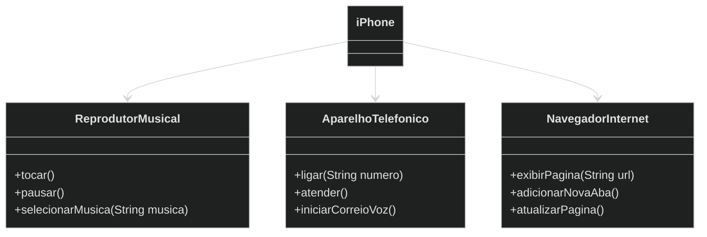

# Diagrama UML de um iPhone

```mermaid
---
config:
  theme: dark
  look: classic
  layout: dagre
---
classDiagram 
class ReprodutorMusical { 
+tocar() 
+pausar()
+selecionarMusica(String musica)
} 
class AparelhoTelefonico {
+ligar(String numero) 
+atender()
+iniciarCorreioVoz()
} 
class NavegadorInternet {
+exibirPagina(String url)
+adicionarNovaAba()
+atualizarPagina()
} 
class iPhone { } 
iPhone --> ReprodutorMusical 
iPhone --> AparelhoTelefonico 
iPhone --> NavegadorInternet
```
